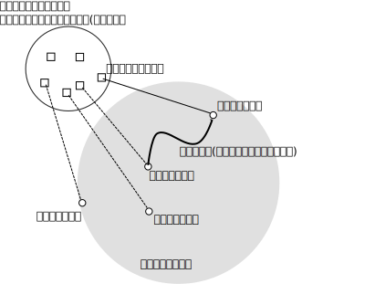
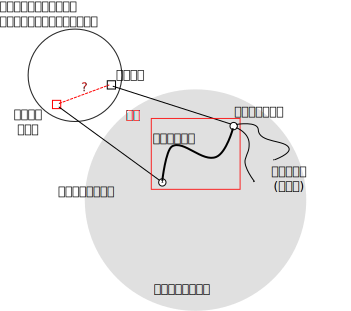
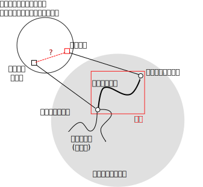
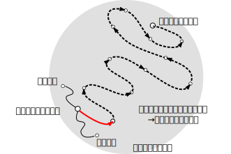
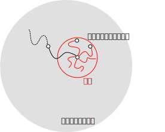
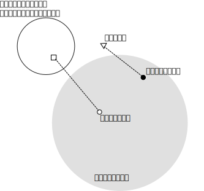
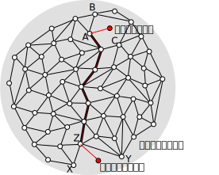

.. _reading:

コードリーディングのモデル
========================================================================

コードリーディングとはどのような行為なのか、本演習で想定したモデルを説明
します。モデルを導入することで、以降に紹介するコードリーディングの技法の位
置付けが明確になり、また応用が効くようになると期待されます。

本演習ではコードリーディングとは次の5つのステップからなる作業
ととらえます。

0. 何かソフトウェアについて疑問を持つ。
1. 既に知っていること(基底知識)に対応するソースコード箇所(コードポイント)を特定する。
2. ベースポイントを選択する。
   - いくつもあるコードポイントからリーディングの起点(ベースポイント)を選択する。
   - 基底知識を駆使してどのコードポイントが適当であるか見定める。
3. ベースポイントと制御フローおよびデータフローでつながるコードポイントを探す(フロー追跡)。
   - ここで新しい知識を獲得する。
   - ここでみつけたコードポイントは次のベースポイントの候補となる。
4. 得た知識で疑問が解決すればリーディングを終了する。解決しなければ、2へ。

2, 3, 4は繰り返します。3で獲得した知識は次の繰り返しの基底知識として使えます。
追跡した制御フロー、データフローの軌跡をコードパスと呼ぶことにします。

制御フローとは、関数の呼び出し順序関係を指します。データフローとは変数
への値の代入、変数の値の参照の順序関係を指します。

モデルの一部として以下の(筆者独自の)用語を導入します。

* 基底知識
* コードポイント
* ベースポイント
* フロー
* コードパス
* プルーフポイント
* プルーフパス
* リーディング資産
* コード仮説
* チェックポイント

制御フロー追跡
-------------------------------------------------------------------------
.. code-block:: c

   int func1()
   {
   	func2();
   }

   int func2()
   {
   	...
   }

* func1はfunc2を呼び出している::

    func1->func2

  - 順方向の制御フロー追跡

* func2はfunc1から呼び出されている::

    func2->func1

  - 逆方向の制御フロー追跡

データフロー追跡
-------------------------------------------------------------------------
.. code-block:: c

   int func3 (int * r)
   {
	*r += 3;
   }
   int func4(int *r)
   {
   	if (r > 10)
		...
   }

* func3で更新したrの値はfunc4で参照されている::

    func3->func4

  - 順方向のデータフロー追跡

* func4で参照したrはfunc3で更新されている::

    func4->func3

  - 逆方向のデータフローの追跡

知識獲得の例
------------------------------------------------------------------------

次のコードを題材として知識獲得について説明します。

.. code-block:: c

	int no_pipe;
	FILE* file;
        int main(int argc, char** argv) 
        { 
                ...
		no_pipe = 0

		for (i = 0; i < argc; i++) 
		{
                	/* 例1のベースポイント */
			if (!strcmp(argv[i], "--no-pipe"))
				no_pipe = 1;
                        ...
                }
		...
        }

	...

	if (no_pipe)
           file = make_temporary_file();

        ...

	FILE* make_temporary_file(void) 
        {
	   /* 例2のベースポイント */
	   int f = mkstemp("myappXXXXXX");
	   if (f >= 0)
		return fdopen(f, "rw");
	   ...
        }

.. _forward:

コードリーディングでできること
------------------------------------------------------------------------

モデルを前提とすると、コードリーディングできることは次の2つです。

1. ある実行条件の元での実行結果と副作用の説明

2. 実行結果や副作用に対する実行条件の説明

この2つを組合せて、ソフトウェアに対する疑問を解決します。

:ref:`forward` は「ある実行条件の元での実行結果と副作用の説明」の例にも
なっています。結論として得られた知識に注目します: 「オプション
`--no-pipe` を与える」という条件の元で「テンポラリファイルを作成する」
という副作用があることを、コードリーディングによって確定したコードパス
が説明しています。

一方 :ref:`backward` は 「実行結果や副作用に対する実行条件の説明」の例
にもなっています。結論として得られた知識に注目します: 「テンポラリファ
イルが作成された」という副作用に対して「オプション `--no-pipe` が与えら
れた」という実行条件を、コードリーディングによって確定したコードパスが
説明しています。

ベースポイントからは様々なフローが延びているので、コードリーディングの
過程で知りたかったこととは直接関係の無い知識を獲得することがあり得ます。
すなわちハズレのコードパスも確定していきます。しかし、もしソースコード
を調べてわかることであれば、ベースポイントが適切に選ぶことで最終的知り
たかったことを説明するコードパスが判明するはずです。このコードパスを特
にプルーフパスと呼ぶことにします。プルーフパスの終点をプルーフポイント
と呼ぶことにします。

.. ベースポイントとゴールパスがあれば第三者によってソースコードから予測、推測の正しさを検証で
.. きます。

フロー追跡の方向
------------------------------------------------------------------------

「ある実行条件の元での実行結果と副作用」を説明するには、フローを順方
向に追います。すなわち実際の処理の順序とコードリーディングの読み進める
順序が同じとなります。ベースポイントから開始して、関数呼び出しに遭遇す
ればそこで呼び出されている関数(callee)の定義を読みます。変数への代入に
遭遇すれば、代入箇所以降でその変数を参照(あるいは消費)している箇所を追
います。

「実行結果や副作用に対する実行条件」を説明するには、フローを逆方向に
追います。すなわち実際の処理の順序とコードリーディングの読み進める順序
が逆になります。ベースポイントを含む関数の呼び出し元関数(caller)の定義
やベースポイントにて参照している変数へ値を代入(あるいは供給)している箇所
を追います。

ソフトウェアに対する疑問の内容によっては、複数の説明を組合せて解決する
必要があります。そのためコードリーディングは順方向、逆方向のフロー追跡
を組合せた作業となります。

順方向にフローを追跡して「ある実行条件の元での実行結果と副作用」を知る例
,,,,,,,,,,,,,,,,,,,,,,,,,,,,,,,,,,,,,,,,,,,,,,,,,,,,,,,,,,,,,,,,,,,,,,,,

マニュアルなどを読んで 「 `--no-pipe` というオプションがある」こと、
「文字列の比較には `strcmp` というglibc Cライブラリに含まれる関数が利用
できる」ことを知っているとします。

これを基底知識とします。

ソースコード中から `--no-pipe` という文字列を検索して基底知識に対する
コードポイントを探します。するとコマンドライン引数と `"--no-pipe"` という
文字列を比較している箇所が見付かります。そこをベースポイントとします。

.. code-block:: c

	if (strcmp(argv[i], "--no-pipe") == 0)

このベースポイントから呼び出している関数の定義および変数の参照箇所を辿っ
て行きます。コマンドライン引数に `--no-pipe` が指定されている場合、変数
`no_pipe` に1が代入されます。そこで次に `no_pipe` の値がどこで参照され
ているかを追います。すると次のコードがみつかります。

.. code-block:: c

	if (no_pipe)
           file = make_temporary_file();	

no_pipeが1の場合、make_temporary_file関数を呼んでいます。そこで
今度はmake_temporary_file関数の定義を見てみます。

.. code-block:: c
	
	   int f = mkstemp("myappXXXXXX");

するとその定義中で `mkstemp` 関数を呼び出しています。ここでマニュアルを
調べてみると、 `mkstemp` はglibc Cライブラリに含まれていて、テンポラリファ
イルを作るための関数であることがわかります [#manual]_ 。

ここで「オプション `--no-pipe` を与えるとテンポラリファイルを作成する」、
という知識を獲得できます。

.. _backward:

逆方向にフローを追跡して「実行結果や副作用に対する実行条件」を知る例
,,,,,,,,,,,,,,,,,,,,,,,,,,,,,,,,,,,,,,,,,,,,,,,,,,,,,,,,,,,,,,,,,,,,,,,,

:ref:`forward` の例とは逆に 「基底知識として目的のコマンドがテンポラリフ
ァイルを作成することがある」こと、「テンポラリファイルの作成には `mkstemp` というglibc 
Cライブラリに含まれる関数を利用できる」こと、を持っているとします。 `--no-pipe` について
は知らない、とします。

ソースコード中で `mkstemp` を文字列検索すると、その関数が使われていることが
わかります。その呼び出し箇所をベースポイントとします。

.. code-block:: c

	   int f = mkstemp("myappXXXXXX");

このベースポイントから関数の呼び出し元および変数の代入箇所を辿っていきます。
`mkstemp` は `make_temporary_file` 関数から呼び出されています。

.. code-block:: c

	if (no_pipe)
           file = make_temporary_file();

`make_temporary_file` 関数が呼び出されるのは `no_pipe` が0でない場合です。
そこで no_pipe へ代入している箇所を探します。

.. code-block:: c

			if (!strcmp(argv[i], "--no-pipe"))
				no_pipe = 1;

するとコマンド呼び出し引数の配列 `argv` のi番目の要素 と
`"--no-pipe"` を 文字列として `strcmp` で比較している箇所に到達します。
ここでマニュアルを調べてみると、 `strcmp` はglibc Cライブラリに含まれていて、
文字列を比較するための関数であることがわかります [#manual]_ 。

ここで「テンポラリファイルが作成されたのは、オプション `--no-pipe` が
与えられたからだった」という知識を獲得できます。

.. _outcome:

ベースポイントと痕跡文字列
------------------------------------------------------------------------

コードリーディングを開始するにはベースポイントが必要です。対象ソフトウェ
アについてベースポイントとして使えそうなコードポイントのストックが無い
場合、ソフトウェアに対する疑問から検索文字列(痕跡文字列)を捻出できない
か検討して下さい。ソースコード中から痕跡文字列を検索することで基底知識
に対応するコードポイントを特定し、それをベースポイントとしてコードリー
ディングを開始できます。

「マニュアルに記載されていないコマンドラインオプション "--using-shm" の
効用を知りたい」とか、あるいは「 "Error: Failed in memory allocation" と
いうエラーメッセージの意味をより詳細に知りたい」、といったように、疑問
が文字列とのかかわりの元で表現されている場合、その疑問が基底知識となり
ます。そして疑問中の文字列が痕跡文字列となります。ソースコード中から起
点文字列を検索することで基底知識に対応するコードポイントを特定し、それ
をベースポイントとしてコードリーディングを開始できます。

「マニュアルに記載されていないコマンドラインオプション "--using-shm" の
効用を知りたい」、であれば 「マニュアルに記載されていないコマンドライン
オプション "--using-shm" 」の存在が基底知識となります。 "--using-shm"
を痕跡文字列としてコードポイントを特定します。それをベースポイントとし
て、フローを順方向に辿れば良いでしょう。

「 "Error: Failed in memory allocation" というエラーメッセージの意味をよ
り詳細に知りたい」、であれば、「対象ソフトウェアは "Error: Failed in memory allocation" と
いうエラーメッセージを出力する」という基底知識とな
ります。 "Error: Failed in memory allocation" を痕跡文字列としてコードポ
イントを特定します。それをベースポイントとして、フローを順方向に辿れば
良いでしょう。

痕跡文字列の捻出
,,,,,,,,,,,,,,,,,,,,,,,,,,,,,,,,,,,,,,,,,,,,,,,,,,,,,,,,,,,,,,,,,,,,,,,,

疑問から直接に検索文字列(痕跡文字列)を捻出できない場合でも、間接的に捻
出できる可能性はあります。

例として「お絵描きソフト」について表示に使っている画像のデータ構造定義
を知りたいとします。痕跡文字列として使えそうな文字列がありません。しか
し、例えばそのお絵描きソフトに "印刷" や "保存" といったメニュー項目が
あったとします。"印刷" や "保存"の処理には、その「お絵描きソフト」の表
示画像のデータが必要となるはずです。

そこで「 "印刷" や "保存" といったメニュー項目がある」ということを基底
知識とします。そして "印刷" や "保存" を痕跡文字列として、ソースコード
を検索することでベースポイントを探します。ベースポイントがみつかれば、
そこから印刷処理や保存処理を担当する関数を探します。これらの関数はメ
ニュー項目とともにまとめてGUIライブラリに登録されていると想像されます。
そこで痕跡文字列である "印刷" や "保存" がデータとしてどのように消費され
ているかデータフローを追う過程で関数が特定されるはずです。

保存関数あるいは印刷関数は呼び出されるときに引数として、画像のデータが
渡されると期待されます。そこでそれらの関数の引数の型を確認します。この
型が画像のデータ構造に対応するはずです。ここで画像を表現するのに使っている
型の名前を基底知識に追加できます。

最後に "..." を痕跡文字列としてソースコードを検索すると、データ構造定義
がみつかるはずです。

この例では、 "印刷" や "保存" を痕跡文字列に選出するのに、暗黙にGUIライブ
ラリに関する基底知識を使っています。そういった基底知識が無い場合であれ
ば、 "image" や "pixelmap" など適当な単語を使ってみるしか無いでしょう。
本当にどうしょうも無い場合は、C言語で記述されたプログラムのエントリーポ
イントであるmain関数の "main" を探して、そこから読むことになります。

痕跡文字列の検索に失敗する原因
,,,,,,,,,,,,,,,,,,,,,,,,,,,,,,,,,,,,,,,,,,,,,,,,,,,,,,,,,,,,,,,,,,,,,,,,

これぞという痕跡文字列をソースコードツリー中で検索しても、どういうわけか検索が
ヒットしない、すなわちコードポイントがみつからない場合があります。良くあるケース
を3つあげます。

コンパイル時文字列合成
........................................................................
文字列リテラルを隣接させたり、Cのプリプロセッサ(cpp)のマクロ定義で#や
##を使うと、コンパイル時に文字列を合成できます。結果として痕跡文字列が "字面" 
として直接にはソースコードにあらわれません。 :ref:`literalstrs` と
:ref:`cpp` にて詳細を説明します。

実行時文字列合成
........................................................................
fprintf関数やprintf関数などが提供する書式付き出力を使っているプログラム
では、実行時に文字列を合成します。例えば次のようなログメッセージを考えてみます::

 	Error: Failed in memory allocation

もし次のような関数呼び出しでこのログメッセージが出力されている場合、
痕跡文字列にコードポイントは検索によってみつかるはずです。

.. code-block:: c

	fputs("Error: Failed in memory allocation", logfile);

ところが次のような書式付き出力関数を使っているとどうでしょう？

.. code-block:: c

        const char* level = "Error";
        const char* resource = "memory";
	fprintf(logfile, "%s: Failed in %s allocation", level, resource);

痕跡文字列を単純に検索してもコードポイントを特定できないでしょう。
正規表現検索を用いるとうまく特定できるかもしれません。
正規表現検索については :ref:`tool` にて説明します。

ソースコードの自動生成
........................................................................
ビルド処理の過程でソースコードを自動生成している場合、痕跡文字列が"字面"
としてあらわれるのは生成されたソースコードファイル中となる可能性があり
ます。ソースコードファイルが生成される前の状態にあるソースコードツリー
を調べても、痕跡文字列は出てこないでしょう。このようなケースにあてはまる
場合、ビルド処理を調べ、何からどのようにソースコードファイルが生成され
ているかを把握する必要があります。 :ref:`buildproc` にてビルド処理を簡単
に説明しますが、十分で無いかもしれません。ビルド処理を読むのが煩わしけ
れば、痕跡文字列の変更を検討しても良いでしょう。

リーディング資産とコード仮説
------------------------------------------------------------------------

痕跡文字列を通してベースポイントを特定することを説明しました。次に
フロー追跡を通したコードパスを確定する作業について考えてみます。

フロー追跡の過程
,,,,,,,,,,,,,,,,,,,,,,,,,,,,,,,,,,,,,,,,,,,,,,,,,,,,,,,,,,,,,,,,,,,,,,,,,,

ベースポイントからは様々なフローが延びています。プルーフパスをみつける
のに様々なフローを試してみる必要が出てきます。フロー追跡の過程で新しい
知見を示唆するいくつものコードポイントに遭遇します。遭遇したコードポイ
ントの多くは、プルーフポイントへとつながるコードパスの上には無いかもし
れません。あるコードポイントについて、プルーフポイントとかかわりがあり
そうだと思ったら、そこをベースポイントとして(ベースポイントの選択と移
動)、再びプルーフポイントへ向けたフロー追跡を開始します。これを繰り返し
て結果的にプルーフポイントへ到達します。

たとえば制御フローを順方向に追跡していると、if/else文、すなわち条件分岐
を目にするでしょう。各条件について異なる関数を呼んでいるとします。それ
ぞれの関数定義を読んで新しい知見を得たら、それぞれの関数定義がコードポ
イントとなります。いくつもの関数定義のうち、その内容から一番プルーフポ
イントへ関連のありそうな関数定義を選択してそれを次のコードリーディング
のベースポイントとします。

プルーフポイントがどういったものなのかはっきりと分っているわけではない
ので、不適当なコードポイントを次のベースポイントとして選択してしまう怖
れがあります。新しいベースポイントから読み進めて手応えが無い場合には、
誤ったベースポイントを選択したとも考えられます。このときは遡ってベース
ポイントを選択し直すところから始めなければいけません。

フロー追跡の過程でベースポイントの選択と移動を繰り返しているうちに、同
じところを繰り返し読んでいることに気付いたり、あるいはプルーフポイント
に迫っている感じがしない、といった理由で絶望的な気分になるかもしれませ
ん。

そのソフトウェアについてコードリーディングを開始して日の浅いうちは、プ
ルーフポイントへ近付いているかどうかということに神経質にならずコードポ
イントを増やしていけていれば良いでしょう。コードポイントを増やす、とい
うことはそのソフトウェアのソースコードに慣れ親しむということです。プルー
フポイントに近付いている気がしなくとも、新しいコードポイントを獲得でき
ていればそれは無駄とはなりません。

ある程度の数のコードポイントを稼いだら、元々何を説明しようとしてソース
コードを読み始めたのかを思い出して、初期ベースポイントを選択し直して読
み始めるとうまく行くかもしれません。「絶望的な気分」になるまでソースコー
ド中をうろついたことで、多くのコードポイントとそれに対応する基底知識を
獲得しているはずです。あらためて初期ベースポイントを決めるヒントとなる
でしょう。

.. 何を知りたいのか忘れる。
.. バックトラックがある。ところがコードポイントを忘れる。
.. 全探索となる。

リーディング資産
,,,,,,,,,,,,,,,,,,,,,,,,,,,,,,,,,,,,,,,,,,,,,,,,,,,,,,,,,,,,,,,,,,,,,,,,,,

読んでいるソフトウェアとのかかわりが一時的なものでなく、今後も繰り返し
読解していくのであれば、読解の途中で得られるコードポイントをより大切に
扱って下さい。いままで「ハズレ」と書いたプルーフパスに上にないコードポ
イントは、今抱いている疑問の解決の直接的な補助とならない場合であっても、
他の疑問の解決する場合や、そのソフトウェアの包括的な理解への重要な資産
(リーディング資産)となる可能性があるからです。

あらたにコードポイントを得たら、次の作業を通してコードポイントに対する
理解を強化できます。

 コードパスの反芻
 	どのベースポイントから読み始めてそのコードポイントに至ったか反芻します。
 周辺の探索
	そのコードポイントから延びるフローを探索します。
 過去の到達事例の回想
	別の目的でソースコードを読んだときに、そのコードポイントに至ったことが
	ないか思い出します。
 より抽象的な言葉を用いた説明
	ソースコードのレベルから離れていより抽象的な言葉でそのソフトウェアにおける
	コードポイントの役割を説明できないか試します。

周辺を探索するとは、旅行において目的地に向う途中で道草を食うことと良く
似ています。具体的には、知りたいこととは直接関係無くとも、既知のコード
ポイントに至るコードパスが無いか、新しく発見したコードポイントを起点に
順方向、逆方向にいくつかのフローを追ってみます。既知のコードポイントに
至るようなコードパスが発見できれば、新しく発見したコードポイントのソフト
ウェア全体に対する位置付けがより明確になり、そのコードパスもリーディング
資産となります。

.. ハブ関数

繰り返し読み、疑問の解決を繰り返していくと、いよいよ多くのコードポイン
トとコードパスが蓄積されます。

コード仮説とチェックポイント
,,,,,,,,,,,,,,,,,,,,,,,,,,,,,,,,,,,,,,,,,,,,,,,,,,,,,,,,,,,,,,,,,,,,,,,,,,

この章の冒頭で、ベースポイントの選択について次のように書きました。

    新しいベースポイントから読み進めて手応えが無い場合には、誤ったベー
    スポイントを選択したとも考えられます。このときは遡ってベースポイン
    トを選択し直すところから始めなければいけません。

ここでは「手応え」について説明します。

ここまで次のベースポイントとして使えそうなコードポイントを現ベースポイ
ントからどのように目指すのか説明してきませんでした。現ベースポイントか
らのびている複数のフローのうちどれを読むべきでしょうか。コードポイント
が増えれば、いずれ見通しが立ってくるのでどのフローを読み進めても無駄に
はならないのですが、できれば大きな遠回りを避けて速くプルーフポイントに
到達したいものです。適切なフローを選択して読み進めているかどうかの指標
として「手応え」があります。

.. いつまでも「手応え」のないまま読み続けるのはつらいものがあります。

ここで「手応え」とは、ソースコードに関する仮説を設定し、読解を進めるこ
とでその仮説の正しさを裏付けることができたことを指します。

さらに具体的に説明するために「コード仮説」と「チェックポイント」という
言葉を導入します。現ベースポイントからこの先読み進めるとどういったコー
ドが出現するはずかを想像し仮説を立てます。これをコード仮説と呼ぶことに
します。コード仮説が正しいとして、仮説中のコードが出現するコードポイン
トを特にチェックポイントと呼びます。仮説が十分に具体的であれば、文字列
検索でチェックポイントを発見できるはずです。

チェックポイントを次のベースポイント候補と位置付けます。
フローをたどるにあたり、現ベースポイントとチェックポイントの間のコードパス
を確定することを目指します。確定できたときそれが「手応え」となります。
逆に時間をかけて読んでも確定できないようであれば、ベースポイント、フロー
の選択、あるいはコード仮説の設定に誤りの可能性があります。

現ベースポイントからチェックポイントへ至るコードパスが確定したところで、
コード仮説に由来する「現ベースポイントからチェックポイントへ至るコード
パス」を基底知識に追加できます。

一度設定したコード仮説は固持するものではありません。リーディングの進行
によってコードポイントとそれに伴う基底知識を獲得した時々で、コード仮説を
更新できないか検討します。コード仮説の設定、更新とチェックポイントまでの
コードパスの探索を交互に繰り返します。

.. 次次にチェックポイントを通過してプルーフポイントに至る。
.. おおきく外れることなく。

はさみうち
........................................................................

フローの追跡はベースポイントから始める必要はありません。チェックポイン
トからベースポイントへのフローを探しても良いです。その組合せでも良いで
す。ベースポイントからの読むのとチェックポイントから読むのではフローを
追う方向が逆となります。つながりを発見したところで、そのつながりをベー
スポイントからチェックポイントへのコードパスとして見直します。

コード仮説の例
........................................................................
たとえば今、 `counter` という変数の値を条件とするif文を読んでいるとします
(ベースポイント)。名前からこの変数は何かを数えた結果を保持する変数であると
想像されます。もし逆方向にデータフローを追っているのであれば、どこかでその
変数の値をインクリメントあるいはデクリメントをしているはずです(コード仮説)。
多くのケースで次のように記述されているでしょう(インクリメントの場合)。

.. code-block:: c

	counter++;

あるいは

.. code-block:: c

	++counter;

インクリメントしているコードを検索して該当するコード行をソースコード
ツリー中で発見できたら、そこがチェックポイントとなります。このは例は小さすぎて、
チェックポイントを見付けることと、データフローを辿ることが同じ作業になって
しまっています。ただしベースポイントにあった `counter` と チェックポイントと
して発見したつもりの `counter` が本当に同じ変数を指すのか確認する必要
があります。C言語に変数名のスコープがあります。同じ変数名であっても
それぞれのスコープが異なれば、変数としては同じではありません。
スコープについては :ref:`scope` にて説明します。

もしチェックポイントに相当するコードを発見できない場合、仮説を設定し直
します。例えば「counter変数の値は別の変数からの代入により与えられる」
というコード仮説を立て直します。

.. 例: 抽象的なコード仮説
.. ........................................................................
.. .. 謎

.. あるGUIアプリケーションに「スペースキーを押すとページをめくる」という機
.. 能を追加したいとします。 "space" あるいは "page" などを痕跡文字列として
.. リーディングを開始することになるでしょう。ここでFedora上で動作するGUIア
.. プリケーションは、ユーザーのマウス操作やキーボード操作をイベントとして
.. Xサーバという別のプログラムから受けとる、という基底知識があったとします。
.. するとそのGUIアプリケーションあるいはリンクしているライブラリのなかに
.. プロセス間通信のAPI呼び出しがあるはずです(コード仮説)。プロセス間通信の
.. API呼び出し箇所を見つけたら、チェックポイントに到達したことになります。

.. このコード仮説は抽象すぎて、痕跡文字列としては使えません。すなわち、そのま
.. まではチェックポイントを文字列検索で発見できません。ベースポイントから
.. 読み始めて、「プロセス間通信」にかかわりそうなフローを漫然と探すことに
.. なります。

.. もしプロセス間通信用のAPIを具体的に知っていれば、それを痕跡文字列と
.. して使えます。フローを追い始める前に対象ソフトウェアが動作するプラット
.. フォームで利用可能なプロセス間通信用のAPIを調べたり、あるいはその
.. ソフトウェアが依存しているライブラリAPI群を調べておくと良いでしょう。

.. Fedoraであれば、例えばsocketというシステムコールがプロセス間通信
.. に使う通信の口を確保するのに使われます。この用な基底知識が加えると
.. 抽象的なコード仮説を具体化できます。

資産家のリーディング
........................................................................

対象ソフトウェアのソースコードに良く慣れ親しみリーディング資産が豊富
になってくると、雪崩れ式に読むのが速くなります。その仕掛けは次のような
ものです。

コードポイントを豊富に持っていると現ベースポイントと、そこからフロー的
に近そうなコードポイントA(あるいはBやC)をみつけてくることができます。そ
のコードポイントを選んでチェックポイントとし、ベースポイントからチェッ
クポイントの間につながりがあるというコード仮説を立てて読むことになりま
す。元々ベースポイントから近い位置にありそうなコードポイントを選んでい
るので、そのコード仮説を裏付けるコードパスを確定するのに必要となるリー
ディングの量も少く済むでしょう。

一度既知のコードポイントとのつながりが判明すれば、既知のコードパスを活
用して、プルーフポイントに近そうなコードポイントZ(あるいはXやY)へベース
ポイントを移動できます。新しいベースポイントからプルーフポイントまで読
み切れば、リーディング完了となります。ここで読解にあたり最初に選んだベー
スポイント(1)そのベースポイントと既知のコードポイントとのコードパス(2)、
ベースポイントの移動先となった既知のコードポイントとプルーフポイントと
のコードパス(3)、プルーフポイント(4)がリーディング資産に追加されます。

渋滞の無い高速道を使った車の運転に例えることができます。自宅から一般道
を経てインターチェンジまで辿りつけば、あとはあとは目的地付近のインター
チェンジまでは、速く移動できます。インターチェンジをおりてから目的地ま
でもう一頑張り必要です。

高速道(既知のコードパス群)が国土(ソースコードツリー)全体を良くカバーし
ていて、しかもインターチェンジ(コードポイント)の数が豊富であれば、どこ
へでも素早く移動できます。

.. 十分な数の蓄積があると、疑問の解決にあたり追跡しないといけないフローの
.. 数を劇的に減らすことができます。あるベースポイントからフローを追跡して、
.. 既知のコードポイント(図中A)に到達した時点で、プルーフポイントに近いので
.. はないかと思いあたるコードポイント(図中B)までのコードパスがわかっていれ
.. ば、あらためてフローを追う必要はありません。Bから読み進めてプルーフポイ
.. ントに到達すればベースポイントからプルーフポイントまでのコードパスを確
.. 定することができます。

.. Bから読み進めてもプルーフポイントに至らない場合でも他のコードポイント、
.. 例えばCやDからアプローチすることもできます。

.. プルーフポイントがどこにあるかわかるわけではない。
.. どこから運転を開始するのか

.. [#manual] マニュアルの見方については :ref:`beforestarting` にて説明
	します。もちろん マニュアル の内容が疑わしい場合、glibc中の `mkstemp` 
	や `strcmp` の定義を調べたくなるかもしれません。演習の課題としています。

