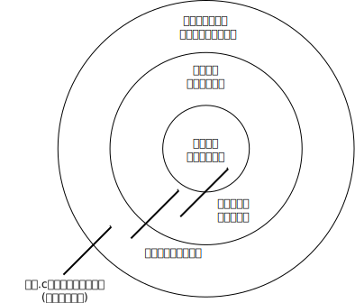

-------------------------------------------------------------------------
C言語復習
-------------------------------------------------------------------------

.. include:: ../header.rst

概要
-------------------------------------------------------------------------
書くではなく読むという観点でC言語の機能を見直す。

* 空白
* インデントスタイル
* 文字列定数の連結
* プリプロセッサ(cpp)
* goto文
* 三項演算子
* ビット演算を用いたフラッグ操作
* 否定の否定
* スコープ
* 初期値が明記されていないstatic変数の値
* コマンドライン引数

空白
-----------------------------------------------------------------------
* 区切り文字として*一つ以上の*スペースやタブが使われる。
* 検索文字列に空白を含めるときに注意する必要がある。

.. code-block:: c

	foo (); /* 関数呼び出し */

このコードを発見するのに例えば

::

	"foo()"

という検索文字列を使うと、目的のコードに合致しない。

インデントスタイル
-----------------------------------------------------------------------
* 書くときはインデントスタイルを統一しましょう、と習う。
* 読むときにはインデントスタイルを選べない。
* インデントスタイルに特徴があればより目的に合致した検索文字列
  を構築できる。

----

例1

.. code-block:: c

	if (a == b)
	  {
	    do_something();
	  }
	else
	  {
	    rest();
	  }

例2

.. code-block:: c

	if (a == b) {
		do_something();
	} else {
		rest();
	}

例3

.. code-block:: c

	if ( a == b )
	{
		do_something();
	}
	else
	{
		rest();
	}

文字列定数の連結
-----------------------------------------------------------------------
* ダブルクォートで囲まれた文字列を文字列リテラル、文字列定数あるいは固定文字列
  と呼ぶ。

* 空白で区切られた隣接する2つ以上の文字列は連結されて1つの文字列定数となる。

----

.. code-block:: c

	/* concat.c */
	const char* str = "abc" "def" "ghi";
	printf("=>%s\nb", str);

----

.. code-block:: console

	$ gcc concat.c
	$ ./a.out
	=>abcdefghi

----

画面に出力された文字列の出所を探そうとソースコードツリー中で
abcdefghiを検索しても、該当する箇所を発見できない。

プリプロセッサ(cpp)
-----------------------------------------------------------------------
* Cコンパイラは入力を処理する前にプリプロセッサを呼び出す。
* ソースコードを変形する。

  - ファイルの読み込み(#include)
  - マクロ展開(#define)

* 書く人にやさしく、読む人に厳しい。
* 検索対象の文字列が変形に由来する場合、ソースコードツリーからは発見できない。

cpp
-----------------------------------------------------------------------
プリプロセスだけの実行
.......................................................................

gccの-Eオプションを使うと引数で与えたcファイルについてプリプロセスだけを実行して
結果を標準出力に表示できる。

----

.. code-block:: console

    $ cat /tmp/foo.c
    #define x "abc"
    x
    $ gcc -E /tmp/foo.c
    # 1 "/tmp/foo.c"
    # 1 "<コマンドライン>"
    # 1 "/tmp/foo.c"

    "abc"

cpp
-----------------------------------------------------------------------
名前の合成
.......................................................................

マクロ定義中で、 ## が使われると、文字列を連結して、変数名、関数名、
型名など識別子を合成する。

----

.. code-block:: c

    /* /tmp/foo.c */
    #define def_inc(A) \
      static int A;    \
      inc##A (void) { A++; }

    def_inc(x)  /* incx, incy関数が定義される。*/
    def_inc(y)

    int main(void)
    {
      incx();   /* ソースコードを呼んでいてincxやincy関数を発見して */
      incx();   /* その定義を探してみつからない。*/
      incy();
      return x + y;
    }

----

.. code-block:: console

    $ gcc -E /tmp/foo.c
    ...省略
    static int x; incx (void) { x++; }
    static int y; incy (void) { y++; }

    int main(void)
    {
      incx();
      incx();
      incy();
      return x + y;
    }

    $ gcc /tmp/foo.c

    $ ./a.out

    $ echo $?
    3

cpp
-----------------------------------------------------------------------
マクロによる文字列化
.......................................................................

マクロ定義中で、 マクロ変数の前に # があるとマクロ変数の値が
(ダブルクォートで括られた)定数文字列へ展開される。

----

.. code-block:: c

    /* /tmp/bar.c, taken from ui/gtk/prefs_dlg.c of wireshark */
    #include <stdio.h>

    typedef enum pref_type {
      PREF_UINT,
      PREF_BOOL,
      PREF_ENUM,
      PREF_STRING,
      PREF_RANGE,
      PREF_STATIC_TEXT,
      PREF_UAT,
      PREF_OBSOLETE,
    } pref_type_t;

    static const char*
    get_pref_type_string(pref_type_t t)
    {
      switch (t)
	{
    #define CASE(T) case PREF_##T: return #T
	  CASE(UINT);
	  CASE(BOOL);
	  CASE(ENUM);
	  CASE(STRING);
	  CASE(RANGE);
	  CASE(STATIC_TEXT);
	  CASE(UAT);
	  CASE(OBSOLETE);
	default:
	  return "UNKNOWN";
	}
    }

    int
    main(int argc)
    {
      printf("=>%s\n", get_pref_type_string(argc));
      return 0;
    }

実行結果

.. code-block:: console

    $ gcc /tmp/bar.c
    gcc /tmp/bar.c
    $ ./a.out
    ./a.out
    =>BOOL
    $ ./a.out a
    ./a.out a
    =>ENUM
    $ ./a.out a b
    ./a.out a b
    =>STRING

get_pref_type_string 関数だけを抜粋してマクロ展開
した結果

.. code-block:: c

    static const char*
    get_pref_type_string(pref_type_t t)
    {
      switch (t)
	{

	  case PREF_UINT: return "UINT";
	  case PREF_BOOL: return "BOOL";
	  case PREF_ENUM: return "ENUM";
	  case PREF_STRING: return "STRING";
	  case PREF_RANGE: return "RANGE";
	  case PREF_STATIC_TEXT: return "STATIC_TEXT";
	  case PREF_UAT: return "UAT";
	  case PREF_OBSOLETE: return "OBSOLETE";
	default:
	  return "UNKNOWN";
	}
    }

goto文
-----------------------------------------------------------------------
* 使用は推奨されていないが、現実には使われている。
* リソースのクリーンアップ処理で特に良く使われる。

.. code-block:: c

    static int __net_init netdev_init(struct net *net)
    {
	    INIT_LIST_HEAD(&net->dev_base_head);

	    net->dev_name_head = netdev_create_hash();
	    if (net->dev_name_head == NULL)
		    goto err_name;

	    net->dev_index_head = netdev_create_hash();
	    if (net->dev_index_head == NULL)
		    goto err_idx;

	    return 0;

    err_idx:
	    kfree(net->dev_name_head);
    err_name:
	    return -ENOMEM;
    }

    /* Taken from
       linux-2.6.32-131.0.15.fc13.x86_64/net/core/dev.c */

三項演算子
-----------------------------------------------------------------------

三項演算子を使った式

.. code-block:: c

	D = A? B: C;

はAが真のときBを、偽(== 0)のときCを返すという意味になる。
if文を使って次のようにも書ける。

.. code-block:: c

	if (A)
		D = B;
	else
		D = C;

returnの値、if/whileなどの条件を記述する箇所で良く使われる。

.. code-block:: c

    /* coreutils-8.15/lib/parse-datetime.c */
    static int
    to_hour (long int hours, int meridian)
    {
      switch (meridian)
	{
	default: /* Pacify GCC.  */
	case MER24:
	  return 0 <= hours && hours < 24 ? hours : -1;
	case MERam:
	  return 0 < hours && hours < 12 ? hours : hours == 12 ? 0 : -1;
	case MERpm:
	  return 0 < hours && hours < 12 ? hours + 12 : hours == 12 ? 12 : -1;
	}
    }

ビット演算を用いたフラッグ操作
-----------------------------------------------------------------------

* ビット演算群を使って正数型(unsigned int)の変数を、フラッグ群として扱う。
* 操作

  - 与えられた変数のn番目のビットをon(1)あるいはoff(0)に設定する。
  - 与えられた変数のn番目のビットがonかoffか調べる。

ビット演算を用いたフラッグ操作
-----------------------------------------------------------------------
「n番目のビット」を指定する定数(マスク値)の定義
.......................................................................
* 操作用の定数(マスク値)を用意していることが多い。
* 定数の定義には #define あるいは enum を用いる。

----

.. code-block:: c

	enum {
		FLAG_X  = 1 << 0,        /* 0番目のビット */
		FLAG_Y  = 1 << 1,        /* 1番目のビット */
		...
		FLAG_Z  = 1 << n,        /* n番目のビット */
		FLAG_0N = FLAG_X|FLAG_Z, /* 0番目とn番目のビット */
	};

ビット演算を用いたフラッグ操作
-----------------------------------------------------------------------
値の取得
.......................................................................
演算子&が使われる。

----

.. code-block:: c

	unsigned int var;
	...
	if (var & FLAG_X) {
		/* FLAG_Xで指定したビットが立っていれば、ここへ
		   制御がうつる。*/
		...
	}

	if (var & FLAG_0N) {
		/* FLAG_0Nで指定したいずれかのビットが立っていれば、
		   ここへ制御がうつる。*/
		...
	}

	if ((var & FLAG_0N) == FLAG_0N) {
		/* FLAG_0Nで指定した両方のビットが立っていれば、
		   ここへ制御がうつる。*/
		...
	}

ビット演算を用いたフラッグ操作
-----------------------------------------------------------------------
フラッグを上げる。
.......................................................................
演算子|= が使われる。

----

.. code-block:: c

	unsigned int var;
	...
	var |= FLAG_X;

ビット演算を用いたフラッグ操作
-----------------------------------------------------------------------
フラッグを下げる。
.......................................................................
演算子 ~ と &= が使われる。

.. code-block:: c

	unsigned int var;
	...
	var &= ~FLAG_X;

否定の否定
-----------------------------------------------------------------------
非0の値を1に、0をそのまま0に変換するのに否定の演算子を2つ重ねた式
が使われることがある。

.. code-block:: c

	b = !!var

これは、

.. code-block:: c

	b = !(var == 0)

と同じ意味になる。

スコープ
-----------------------------------------------------------------------
* 変数名や関数名が参照されうる範囲のことをスコープと言う。
* C言語には、狭い順に3種類のスコープがある。

  - 文内
  - .cファイル内
  - プログラム全域

* スコープを使うとリーディングの範囲を狭めることができる。

スコープ
-----------------------------------------------------------------------
文内
.......................................................................

* 文中で定義された変数をローカル変数と呼ぶ。
* ローカル変数の名前は、それが定義された文中からのみ参照できる。

参照できない例

.. code-block:: c

    int main(void)
    {
      for (int i = 0; i++; i < 10)
	  ;
      return i; /* for文で定義されたiを参照できない。*/
    }

スコープ
-----------------------------------------------------------------------
文内: 複文
.......................................................................

* {と}を使うと複数の文をまとめた複文(ブロック)を作れる。
* ブロック中に定義した変数の名前は、そのブロック中でのみ参照可能である。
* 関数の仮引数の名前はその関数定義中で参照可能である。

.. code-block:: c

	int foo(int o)
	{
		int p;
		...		/* o, pが参照可能 */
		{
			int q;
			...     /* o, p, qが参照可能 */
		}
		...             /* o, pが参照可能 */
	}

スコープ
-----------------------------------------------------------------------
文内: ローカル関数宣言
.......................................................................

* 規格化されたC言語の範囲ではローカル関数を定義できない。
* ただし文中で(他の箇所で定義された)関数を宣言することはできる。

.. code-block:: c

    G_MODULE_EXPORT void
    plugin_register (void)
    {
      {extern void proto_register_wimaxmacphy (void); proto_register_wimaxmacphy ();}
    }

    G_MODULE_EXPORT void
    plugin_reg_handoff(void)
    {
      {extern void proto_reg_handoff_wimaxmacphy (void); proto_reg_handoff_wimaxmacphy ();}
    }

スコープ
-----------------------------------------------------------------------
プログラム全域
.......................................................................

* .cファイル内にあって関数定義の外側をトップレベルと呼ぶ。

.. code-block:: c

   /* ここトップレベル */
   void foo(void)
   {
	/* ここはトップレベルではない */
   }

   /* ここトップレベル */

* トップレベルでstatic修飾子無しで定義されている関数あるいは変数の
  名前はプログラム全域から参照できる。

* 変数名について特に大域変数と呼ぶ。

* ただし参照箇所において、その名前が宣言されている必要がある。

* 通常ヘッダファイルにて名前が宣言され、参照箇所を含む.cファイルはその
  ヘッダファイルをインクルードする。

* 変数の宣言にはextern修飾子がつけられる。
  (つけないと定義になってしまう。)

スコープ
-----------------------------------------------------------------------
.cファイル内
.......................................................................

* トップレベルでstatic修飾子付きで定義されている関数あるいは変数の
  名前はその定義のある.cファイルからだけ参照される。

.. code-block:: c

	static int counter;
	static void func (void);

* ファイルローカル変数、あるいはファイルローカル関数と呼ぶことがある。

* 異なる2つの.cファイルで同じ名前のファイルローカル変数があっても、その
  実体(定義)は別ものである。

* スコープと関係無いが変数は0で初期化される。

スコープ
-----------------------------------------------------------------------
典型的なスコープの使い分け
.......................................................................

スコープ
-----------------------------------------------------------------------
参照によるスコープの崩壊
.......................................................................

スコープにより名前で直接参照できない場合でも、ポインタ変数を介してその名前で
指し示す定義を参照できてしまう。

----

.. code-block:: c

	/* bar.h */
	void func(int * p);

.. code-block:: c

	/* bar.c */
	static int * pointer;

	void func(int * p)
	{
		pointer = p;
	}

.. code-block:: c

	/* foo.c */
	#include "bar.h"
	static int file_private;

	...
	{
		...
		func(&file_private);
		...
	}

----

* foo.c中のファイルローカル変数file_privateは、他の.cファイルから
  名前では参照できない。

* func経由で変数のアドレスを渡すことでbar.cからアクセスできてしまう。

* 変数のアドレスを取得する、&単項演算子に注意する。

初期値が明記されていないstatic変数の値
-----------------------------------------------------------------------
初期値が明記されていないstatic変数の値は、実行時に実行環境が0で塗り潰します。

.. code-block:: c

		static boolean b;
		static int i;
		static void* p;

は

		static boolean b = false;
		static int i = 0;
		static void* p = NULL;

と読み替えることができます。

コマンドライン引数
-----------------------------------------------------------------------

プログラムの起動引数(コマンドライン引数)はmain関数に渡される。

個数
	- 第1引数として渡される。
	- int型
	- 慣例でargcと名付けられる。

内容
	- 第2引数として渡される。
	- char*型の配列
	- 慣例でargvと名付けられる。
