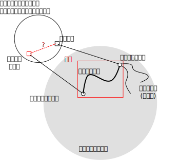
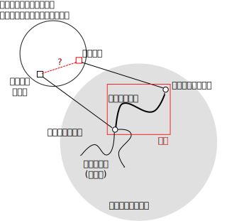
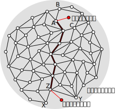
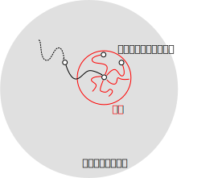

-------------------------------------------------------------------------
コードリーディングの作業モデル
-------------------------------------------------------------------------

.. include:: ../header.rst

はじめに
-------------------------------------------------------------------------
* ソフトウェアの規模が小さいうちは「全て読む」ことで「ソースコードリー
  ディング」できる。
* 規模が大きくなると

  - 全部を読むのは現実的ではない。
  - 「ソースコードリーディング」をやるといっても何から手をつければ良いかわからない。  

* 「ソースコードリーディング」をより具体的な作業として説明する。

  - 読み始める場所を決める。
  - フローを追跡する。

モデル(図)
-------------------------------------------------------------------------
.. figure:: ../../model0.svg
	:scale: 160%

モデル(説明)
-------------------------------------------------------------------------
0. 何かソフトウェアについて疑問を持つ。
1. 既に知っていること(基底知識)に対応するソースコード箇所(コードポイント)を特定する。
2. ベースポイントを選択する。

   - いくつもあるコードポイントからリーディングの起点(ベースポイント)を選択する。
   - 基底知識を駆使してどのコードポイントが適当であるか見定める。

3. ベースポイントとつながるコードポイントを探す(フロー追跡)。

   - ここで新しい知識を獲得する。
   - ここでみつけたコードポイントは次のベースポイントの候補となる。

4. 得た知識で疑問が解決すればリーディングを終了する。解決しなければ、2へ。

モデル(追加の用語)
-------------------------------------------------------------------------

* 目的の情報が記述されたコードポイントをプルーフポイントと呼ぶ。

* あるコードポイントから1回以上のフロー追跡を繰り返して、別のコードポイント
  に到達した場合、その経路をコードパスと呼ぶ。

* 最初のベースポイントとプルーフポイントの間のコードパスを特に
  プルーフパスと呼ぶ。

つながり
-------------------------------------------------------------------------
制御フロー
   関数の呼び出し関係
データフロー
   データの更新とそれを利用する関係

制御フロー追跡
-------------------------------------------------------------------------
 .. code-block:: c

   int func1()
   {
   	func2();
   }

   int func2()
   {
   	...
   }

* func1はfunc2を呼び出している::

    func1->func2

  - 順方向の制御フロー追跡

* func2はfunc1から呼び出されている::

    func2->func1

  - 逆方向の制御フロー追跡

データフロー追跡
-------------------------------------------------------------------------
.. code-block:: c

   int func3 (int * r)
   {
	*r += 3;
   }
   int func4(int *r)
   {
   	if (*r > 10)
		...
   }

* func3で更新したrの値はfunc4で参照されている::

    func3->func4

  - 順方向のデータフロー追跡

* func4で参照したrの値はfunc3で与えられている::

    func4->func3

  - 逆方向のデータフローの追跡

コードリーディングでできること(1)
------------------------------------------------------------------------
ある実行条件の元での実行結果と副作用の説明
........................................................................

コードリーディングでできること(2)
------------------------------------------------------------------------
実行結果や副作用に対する実行条件の説明
........................................................................

知識獲得の例(コード)
-------------------------------------------------------------------------

.. code-block:: c
	:linenos:

	int no_pipe;
	FILE* file;
        int main(int argc, char** argv) 
        { 
                ...
		no_pipe = 0

		for (i = 0; i < argc; i++) 
		{
                	/* 例1のベースポイント */
			if (!strcmp(argv[i], "--no-pipe"))
				no_pipe = 1;
                        ...
                }
		...
        }

	...

	if (no_pipe)
           file = make_temporary_file();

        ...

	FILE* make_temporary_file(void) 
        {
	   /* 例2のベースポイント */
	   int f = mkstemp("myappXXXXXX");
	   if (f >= 0)
		return fdopen(f, "rw");
	   ...
        }

知識獲得の例
-------------------------------------------------------------------------
「ある実行条件の元での実行結果と副作用」
.........................................................................
基底知識

  * 「 `--no-pipe` というオプションがある」こと
  * 「文字列の比較には `strcmp` というglibc Cライブラリに含まれる関数
      を利用できる」

フロー追跡

  1. `--no-pipe` を文字列を検索してベースポイントをとする。

   .. code-block:: c

			if (!strcmp(argv[i], "--no-pipe"))
				no_pipe = 1;

  2. 順方向にデータフローを追う: no_pipeに設定された1はどこで参照されているか？

   .. code-block:: c

	if (no_pipe)
           file = make_temporary_file();	

  3. 順方向に制御フローを追う: make_temporary_file関数は何をやっているか？

   .. code-block:: c
	
	   int f = mkstemp("myappXXXXXX");

獲得した知識

  * --no-pipeオプションを指定すると処理の過程でテンポラリファイルファイルを作る。
  * テンポラリファイルファイルを作るためにmake_temporary_file関数中でmkstemp関数を呼び出す。
  
知識獲得の例
-------------------------------------------------------------------------
「実行結果や副作用に対する実行条件」
.........................................................................
基底知識

  * 「目的のコマンドがテンポラリファイルを作成することがある。」
  * 「テンポラリファイルの作成には `mkstemp` という関数を利用できる。」

フロー追跡

   1. `mkstemp` を文字列検索してベースポイントとする。

   .. code-block:: c

	   int f = mkstemp("myappXXXXXX");

   2. 逆方向に制御フローを追う: mkstempを呼び出しているのはどの関数か？

   .. code-block:: c

	FILE* make_temporary_file(void) 
        {
	   /* 例2のベースポイント */
	   int f = mkstemp("myappXXXXXX");

   3. 逆方向に制御フローを追う: make_temporary_fileを呼び出しているのはどの関数か？

   .. code-block:: c

	if (no_pipe)
           file = make_temporary_file();

	   
   4. 逆方向にデータフローを追う: no_pipeに0以外の値を設定しているのはどこか？

   .. code-block:: c

			if (!strcmp(argv[i], "--no-pipe"))
				no_pipe = 1;

   5. 逆方向にデータフローを追う: argvの値はどこからやって来るか?

   .. code-block:: c

        int main(int argc, char** argv) 

獲得した知識

  * テンポラリファイルを作成するのはコマンドライン引数に--no-pipeを与えた場合である。
  
どのようにベースポイントを決めるか
-------------------------------------------------------------------------

1. 基底知識として何か疑問に関連する文字列(痕跡文字列)を仕入れる。
2. 痕跡文字列がみつからなければ、なんとしてみつける。
	- みつからなかったら2へ。
	- みつかったら3へ。
3. ソースコード中で痕跡文字列を検索してベースポイントの候補を探す。

痕跡文字列
-------------------------------------------------------------------------

  * プログラムからの出力
  * GUI上のラベル
  * 使っていそうなライブラリ関数やシステムコールの名前など

    - 例: mkstemp

  * 関心のある処理と関係がありそうな適当な英単語

    - 何かデータの保存処理: write, save, record, commit, sync,...
    - 何かデータの初期化処理: new, make, init, alloc, construct, ...
    - ...

  * 他に手が無ければ...main

痕跡文字列の検索に失敗する原因
-------------------------------------------------------------------------

* コンパイル時に文字列が合成されている場合

  - 隣接する文字列リテラルの連結機能
  - #による文字列化機能
  - ##による名前合成機能

* 実行時に文字列が合成されている場合

  - strcatなどによる文字列の連結機能
  - printfなどによる書式付き文字列出力機能

* ソースコードが自動生成されている場合

フロー追跡の過程(1)
-------------------------------------------------------------------------

.. code-block:: c

	void func(void)
	{
		func1();

		if (condition)
			func1();
		else
			func2();
			
		func3();
		...
	}

* 順方向にフローを追跡していてfuncに辿りついた。
* 次にどれを読めば良いか？

フロー追跡の過程(2)
-------------------------------------------------------------------------

.. figure:: ../../track.svg
	:scale: 150%

* 適切に「次のベースポイント」を選択できたら早く目的の知識が手に入る。
* でも、ハズレを怖れるな!

  - 目的の知識とは関係の無いが重要なコードポイントと知識が手に入ることがある。
  - ここで獲得した知識が後々、適切なベースポイント選択のヒントとなる。

リーディング資産
-------------------------------------------------------------------------
リーディングを繰り返し多くのコードポイント、コードパスを知っていると、速く読めるようになる。

* AからZまでのコードパスがあることは既に知っている。
* ベースポイントからAまで、Zからプルーフポイントまでのパスはみつけないといけない。

道草
-------------------------------------------------------------------------
コードポイント、コードパスを稼ぐためにあえて「はずれ」のフローを読んでみる。

